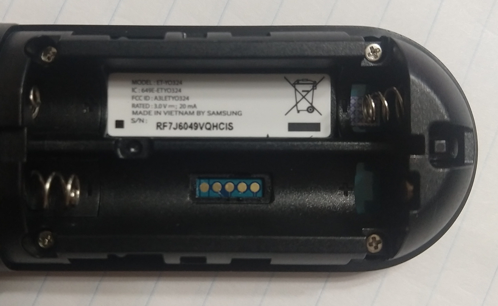

# Exploring the Gear VR Controller

I have been interesting in using Gear VR Controller for another project. As part of that I have been trying to understand how this controller works. I'll use this document to give a overview of what I have learned.

In working through these things, I was hoping to understand how the current firmware works so I could better make use of it in my project, or if things went really well, reprogram the controller entirely.

## Mag Calibration and Offsets

There was some great work done on making this controller usable here https://github.com/jsyang/gearvr-controller-webbluetooth. The sensor fusino in this demo is not quite right as pointed out in many of the issues. I found the problem with the implemenation was the magnetometer calibration and the magnetometer placement.

For the calibration I add a feature where by holding down both the "back" and "trigger" button at the same time, the program records the max/min values for each axis. Then it normalizes the values during normal usage.

I did an analysis of the values coming out of the controller and discovered the magnetometer must be on the "touchpad" part and the accelerometer and gyroscope are on the handle. I estimated the angle between the two parts of the controller is 30 degrees. By applying the a 30 degree rotation to the magnetometer values we can get them to be on the same plane as the other sensors. Also I had to negate the X value. Some of this was discovered with trial and error.

I applied the following:

```
//Apply Calibration Values
if(this.calibrationValues !== null && this.calibrationCount > 10) {
    magX = (magX - this.calibrationValues[0]) / (this.calibrationValues[1] - this.calibrationValues[0]) - 0.5;
    magY = (magY - this.calibrationValues[2]) / (this.calibrationValues[3] - this.calibrationValues[2]) - 0.5;
    magZ = (magZ - this.calibrationValues[4]) / (this.calibrationValues[5] - this.calibrationValues[4]) - 0.5;
}

//Rotate values by 30 degrees.
let rMagX = -magX;
let rMagY = magY * Math.cos(this.controllerAngle) + -magZ * Math.sin(this.controllerAngle);
let rMagZ = magY * Math.sin(this.controllerAngle) +  magZ * Math.cos(this.controllerAngle);
```

Try out the [github pages](cwig.github.io/gearvr-exploration/index.html) for this repo so see the improvement. It is much more stable. Just remember to do the calibration by holding down the "back" and the "trigger" at the same time and swinging the remote in a figure 8.

Also, in order to make the movements looks better, I adjusted the OBJ model the main controller handle is on a level plane.

## OTA Firmware Updates

After a disassembly of one of my controllers and by using reference images from https://jsyang.ca/hacks/gear-vr-rev-eng. I discovered that it seems to be using a [DA14681](https://www.dialog-semiconductor.com/products/bluetooth-low-energy/da14680-and-da14681#tab-field_tab_content_resources) for the main module and the firmware is stored in what appears stored on the neighboring component [GD25LQ32E](https://www.gigadevice.com/flash-memory/gd25lq32e/). Having the datasheet for both gave a lot of interesting information

When reading on https://jsyang.ca/hacks/gear-vr-rev-eng I learned about the "Gear VR Input Service" app which can be download. When you download this app you unzip the apk and find two interesting files. `assets/firmware/downgrade/FOTA_YO324XXU0AQC1.img` and `assets/firmware/upgrade/FOTA_YO324XXU0AQD4.img`. I have 4 controller in total and two had the firmware version `YO324XXU0AQC1`, one had `YO324XXU0AQD4`, and another had `YO324XXU0AQBG` which I have not been able to find any other reference to. Eventually I might try dumping `BG` firmware if I ever find out more about how to do that. Interesting the `.img` files are not traditional firmware files. They appear to be in a special "SUOTA" format defined by Dialog Semiconductor for updating firmware over BLE.

Afte reading the documentation from the DA14681 datasheet and distroying one of my controllers so I could figure out what pins connect where, I found I could send firmware `.img` using the [Dialog Semiconductor app](https://play.google.com/store/apps/details?id=com.dialog.suota). After you connect to the app and extract the `.img` file from the APK, with your phone you want the following settings for the update:
- MISO GPIO: P0_2
- MOSI GPIO: P0_1
- CS GPIO: P0_5
- SCK GPIO: P0_0
- Image Bank: 0 (default, I'm not sure what this one is or what happens if you change it)
- Block Size: 240 (default)

This should run for a little bit and then next time you connect to your device, the firmware should be updated. I'm not sure what the differences are between the firmware versions.

## On Board Pinouts

On the board there are 5 contact points under the battery. In fact, there is just a little sticker you can pull off to access them which out taking apart the controller.



From left to right the pins are as follows (The naming is based on the [DA14681](https://www.dialog-semiconductor.com/products/bluetooth-low-energy/da14680-and-da14681#tab-field_tab_content_resources) datasheet):

1. 3.3v
2. ADC2/P1_3
3. P2_3
4. GND
5. RST

There is a 1K resistor between the contact and the IO pins and what I think it a pull down resistor to ground for the IO pins.

This is interesting because in the datasheet it talks about a boot order.

Boot number 5 says:

```
UART
UTX => P1_3
URX => P2_3
```

Then boot number 6, which looks exactly like the pin out we used for the OTA update:

```
SPI Slave
MISO => P0_2
MOSI => P0_1
SPI_CLK => P0_0
SPICS => P0_5
```

I still haven't had a chance to test this, but it would be really intersting if these pins could be use to reprogram the device. The datasheet talks about a "One Time Programmable Memory" and I'm not sure how to check if it is already burned. I will update this section as I learn more.

## Other Interesting Resource

- A Pokemon GO device with a similar BLE module has been reverse engineered extensively and some interesting things could be learned from that.
  - https://tinyhack.com/2018/11/21/reverse-engineering-pokemon-go-plus/
  - https://www.reddit.com/r/pokemongodev/comments/5ovj04/pokemon_go_plus_reverse_engineering_write_up/
  - https://coderjesus.com/blog/pgp-suota/

## License

Code in this repo that is derivative of https://github.com/jsyang/gearvr-controller-webbluetooth is licensed under GPL-3.0. Any code I contribute that is independant of that work will be under MIT.
